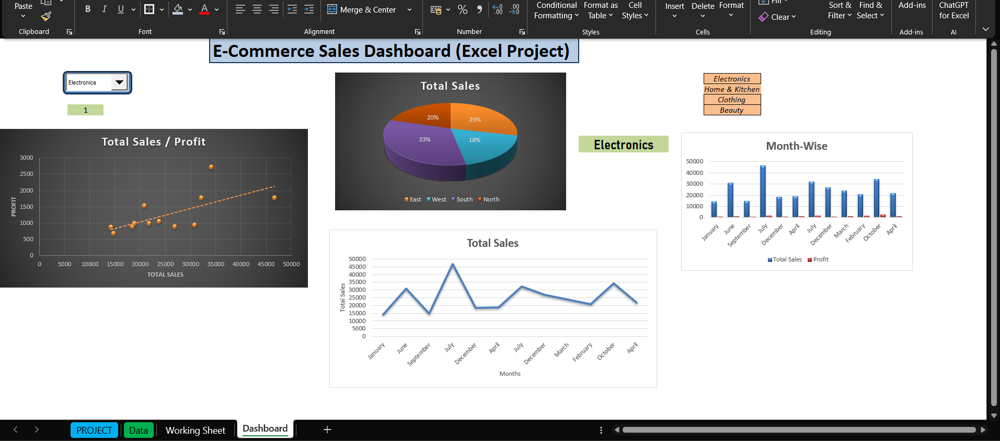

# E-Commerce Sales Dashboard – Excel Project

## Overview
Developed an interactive Excel dashboard that analyzes sales performance across products, regions, and time periods. The dashboard provides dynamic insights into sales quantity, total sales, and profit, supporting data-driven decision-making for business stakeholders.

## Key Features
- **Data Cleaning & Structuring:** Processed raw data to enable monthly and regional sales analysis.
- **Dynamic Metrics:** Utilized `SUMIFS` formulas to calculate Sales Quantity, Total Sales, and Profit dynamically.
- **Visualizations:**
  - Column Chart – Month-wise Sales & Profit
  - Pie Chart – Region-wise Sales distribution
  - Scatter Plot – Sales vs Profit analysis
  - Line Chart – Monthly Sales Trend
- **Interactive Controls:** Integrated Combo Box for filtering visuals and tables by Product Category.
- **User-Friendly Interface:** Designed a fully interactive dashboard for easy exploration of sales data.

## Tools & Technologies
- Microsoft Excel  
- Data Cleaning Techniques  
- SUMIFS formula  
- Excel Charts and Slicers  
- User Controls (Combo Box)

## Usage
Open the Excel file and use the Combo Box slicer to filter data by product category. Explore various charts for monthly and regional sales trends and performance insights.

## Visual Preview

---
